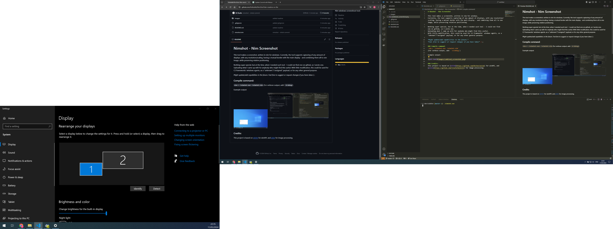

# Nimshot - Nim Screenshot

This tool makes a screenshot, written in nim for windows.
Currently, the tool supports capturing of any amount of displays, with any resolution/scaling, having a mutual border with the main display - and combining them all to one image, while preserving relative positioning.

Nothing super special, but at the time, when I needed such tool - I could not find one on github, so I wrote one.
Uploading what I came up with for anybody who might find this useful.
With little modification, this could be used for C2 frameworks' windows agents, as a "unknown"/"unsigned" payload, or for any other general purpose.

*Might update/add capabilities in the future.*
*Feel free to suggest or request changes if you have ideas* (-;

### Compile command:
`nim c .\nimshot.exe .\nimshot.nim` 
(For verbose output, add: `-d:debug`)

Example output:

### Credits:
This project is based on [winim](https://github.com/khchen/winim) for winAPI, and [pixie](https://github.com/treeform/pixie) for image processing.